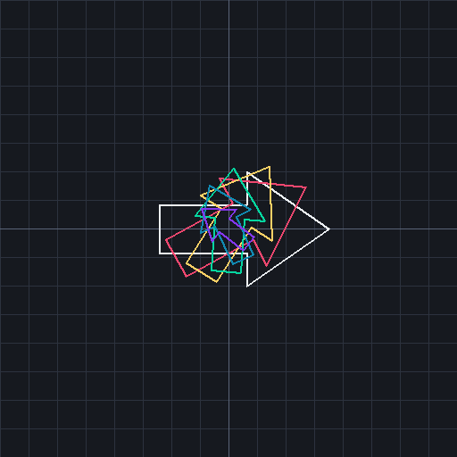

# sml-glm

Pure Standard ML linear algebra and transforms for graphics, simulation, and
geometry — the math half of an OpenGL-style toolkit, with **no FFI and no
external dependencies**. Builds and tests byte-identically under both
[MLton](http://mlton.org/) and [Poly/ML](https://www.polyml.org/).



*Generated by [`examples/transforms.sml`](examples/transforms.sml) (`make
example`): an arrow polygon transformed by a fan of `Mat3` rotate+scale
matrices (homogeneous 2D coords via `Mat3.mulV`), rasterized over a coordinate
grid. Rendering uses the vendored `sml-raster` / `sml-image`.*

`sml-glm` covers the pieces you reach for constantly when doing 3D math:
2/3/4-component vectors, 3x3 and 4x4 matrices, quaternions, and the standard
camera/projection transforms (`lookAt`, `perspective`, `ortho`). Matrices are
stored **column-major**, matching the OpenGL convention, so the values map
directly onto what a GPU expects.

## Status

- 95 assertions, green on MLton and Poly/ML.
- Basis-library only; deterministic across compilers.

## Install

With [`smlpkg`](https://github.com/diku-dk/smlpkg):

```
smlpkg add github.com/sjqtentacles/sml-glm
smlpkg sync
```

Then include the library's MLB from your own:

```
local
  $(SML_LIB)/basis/basis.mlb
  lib/github.com/sjqtentacles/sml-glm/glm.mlb
in
  ...
end
```

This brings `structure Glm` into scope.

## Quick start

```sml
val view = Glm.Mat4.lookAt
  { eye    = Glm.Vec3.v (0.0, 0.0, 5.0)
  , center = Glm.Vec3.v (0.0, 0.0, 0.0)
  , up     = Glm.Vec3.v (0.0, 1.0, 0.0) }

val proj = Glm.Mat4.perspective
  { fovy = Glm.radians 60.0, aspect = 16.0 / 9.0, near = 0.1, far = 100.0 }

val model = Glm.Mat4.mul
  ( Glm.Mat4.translate (Glm.Vec3.v (1.0, 0.0, 0.0))
  , Glm.Mat4.rotateY (Glm.radians 30.0) )

val mvp = Glm.Mat4.mul (proj, Glm.Mat4.mul (view, model))

(* upload `Glm.Mat4.toList mvp` (16 column-major reals) to a shader *)
```

Quaternions for tumble-free rotation and smooth interpolation:

```sml
val a = Glm.Quat.fromAxisAngle (Glm.Vec3.v (0.0, 1.0, 0.0), Glm.radians 0.0)
val b = Glm.Quat.fromAxisAngle (Glm.Vec3.v (0.0, 1.0, 0.0), Glm.radians 90.0)
val mid = Glm.Quat.slerp (a, b, 0.5)          (* a 45-degree rotation *)
val rotated = Glm.Quat.rotateV (mid, Glm.Vec3.v (1.0, 0.0, 0.0))
```

## What's inside

| Module | Highlights |
| --- | --- |
| `Glm.Vec2` / `Vec3` / `Vec4` | `add`, `sub`, `scale`, `dot`, `cross` (Vec3), `length`, `normalize`, `lerp`, `dist`, `approx` |
| `Glm.Mat2` | `mul`, `transpose`, `det`, `inverse` (`NONE` if singular), `mulV` |
| `Glm.Mat3` | `mul`, `transpose`, `det`, `inverse` (`NONE` if singular), `mulV` |
| `Glm.Mat4` | `mul`, `transpose`, `det`, `inverse`, `translate`, `scaleM`, `rotate`/`rotateX/Y/Z`, `perspective`, `ortho`, `frustum`, `lookAt`, `transformPoint`, `transformDir`, `toList` |
| `Glm.Quat` | `fromAxisAngle`, `mul`, `conj`, `normalize`, `rotateV`, `slerp`, `toMat4`, `fromMat3` |
| top level | `radians`, `degrees`, `clamp`, `lerp`, `pi`, `project`, `unproject` |

### Mat2, frustum, and screen-space projection

```sml
(* 2x2 matrices, same shape as Mat3/Mat4 (column-major, NONE if singular) *)
val r90 = Glm.Mat2.fromRows (Glm.Vec2.v (0.0, ~1.0), Glm.Vec2.v (1.0, 0.0))
val v'  = Glm.Mat2.mulV (r90, Glm.Vec2.v (1.0, 0.0))     (* (0.0, 1.0) *)

(* general (possibly off-center) perspective frustum, glFrustum semantics *)
val proj = Glm.Mat4.frustum
  { left = ~1.0, right = 1.0, bottom = ~1.0, top = 1.0, near = 1.0, far = 100.0 }

(* world <-> screen, gluProject / gluUnProject semantics *)
val vp  = { x = 0.0, y = 0.0, width = 800.0, height = 600.0 }
val win = Glm.project   { obj = p,   model = view, proj = proj, viewport = vp }
val obj = Glm.unproject { win = win, model = view, proj = proj, viewport = vp }
(* unproject (project p) = p, up to rounding *)
```

`Glm.Mat2` mirrors the `Mat3`/`Mat4` interface (`id`, `fromRows`/`fromCols`,
`mul`, `transpose`, `det`, `inverse`, `mulV`, ...). `Mat4.frustum` is the
general perspective projection of which `perspective` is the symmetric special
case. `project` maps an object-space point to window coordinates (pixel `x`/`y`,
depth `z` in `[0, 1]`); `unproject` is its inverse and returns `Vec3.zero` when
`proj * model` is singular.

### Conventions

- **Column-major** storage (`Mat4.toList` yields elements in column order).
- Right-handed coordinate system; `lookAt`/`perspective` produce a right-handed
  view looking down `-Z`, matching OpenGL.
- Inverses of singular matrices return `NONE` rather than raising.
- `normalize` of a zero vector returns the zero vector (no division by zero).
- `Real.==` underlies `equal`; use `approx eps` for tolerance-based comparison.

## Build & test

```
make test        # build + run the suite under MLton
make test-poly   # run the suite under Poly/ML
make all-tests   # both compilers
make clean
```

## License

MIT — see [LICENSE](LICENSE).
